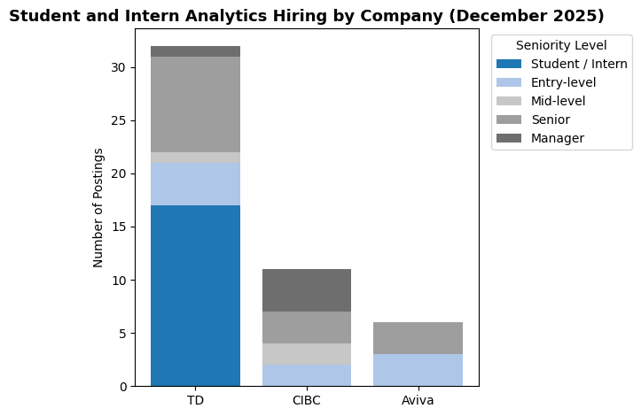
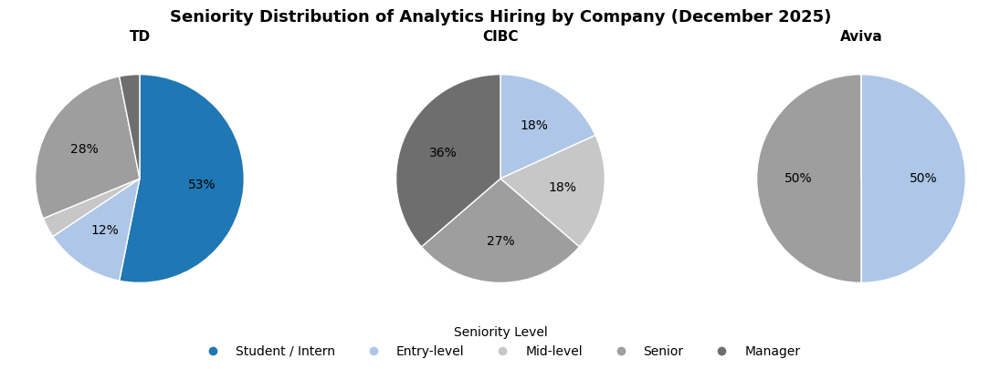
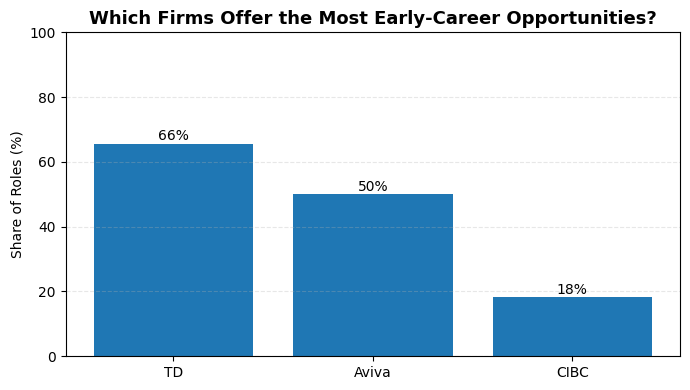

# 🇨🇦 Canadian Job Market Analytics Pipeline
### End-to-End Data Analytics Project 

## Objective 
The goal of this project was to analyze data-related hiring patterns across a targeted set of major Canadian firms, with a focus on Toronto-based roles posted in December 2025.

As an early-career data science student preparing to enter the Canadian job market, I built an end-to-end pipeline to:
- quantify active hiring volume
- assess seniority distribution
- identify employer-level concentration in data hiring

The project emphasizes clean data collection, deduplication, and SQL-based analysis to transform raw job postings into a structured dataset for labor market insights.

## Table of Contents
- [Objective](#objective)
- [Data Sources](#data-sources)
- [Technologies](#technologies)
- [Data Pipeline Architecture](#data-pipeline-architecture)
- [Data Collection & Ingestion](#data-collection--ingestion)
- [Data Cleaning & Deduplication](#data-cleaning--deduplication)
- [Analytics & Visualizations](#analytics--visualizations)
- [Key Findings & Conclusions](#key-findings--conclusions)
- [Challenges & Limitations](#challenges--limitations)
- [Future Work](#future-work)

## Data Sources 
The dataset was constructed from publicly available job postings collected directly from Workday-powered career portals of a targeted set of major Canadian firms in the banking and insurance sectors.

**Scope and Selection**
- Companies were selected based on national footprint and availability of structured job data through Workday
- Analysis was limited to Toronto-based roles to control for geographic variation
- The data reflects job postings available during December 2025

**Data Collected**

For each posting, the following fields were extracted:
- company
- job_id (unique identifier)
- title
- location
- posted_date
- category
- url
- source

All data was collected from publicly accessible listings, with no authentication, scraping of private systems, or personal data involved.

## Technologies
The following technologies were used to build this project: 
- **Python** — data ingestion, cleaning, deduplication  
- **SQL** — analytical querying  
- **AWS S3** — raw data storage
- **AWS Glue** — schema inference and table creation
- **Amazon Athena** — SQL-based querying  
- **Pandas** — data manipulation  
- **Matplotlib** — visualization  
- **Jupyter Notebook** — analysis and documentation  

## Data Pipeline Architecture 
The project is organized into the following stages:

**Step 1: Data Collection & Ingestion**
- Python scripts used to collect job postings from Workday-powered career portals

**Step 2: Cleaning & Deduplication**
- Raw job posting data cleaned and deduplicated using `job_id` to identify unique roles

**Step 3: Storage**
- Cleaned datasets stored in **AWS S3**, with an **AWS Glue Crawler** used to infer schema and create queryable tables for downstream analysis

**Step 4: Analytics**
- SQL queries executed in **Amazon Athena** on Glue-cataloged tables to analyze hiring volume, seniority distribution, and employer concentration

**Step 5: Visualization**
- Analytical results visualized using **Python (Matplotlib)** in Jupyter Notebook

## Data Collection & Ingestion
Job posting data was collected using Python from publicly accessible, Workday-powered career portals.

For each company, the ingestion process involved:
- identifying and validating undocumented Workday API endpoints
- issuing structured HTTP POST requests with custom headers and payloads
- handling pagination to retrieve complete result sets
- filtering postings by role relevance and location (Toronto)

Each job posting was assigned a unique `job_id`, which served as the primary identifier throughout the pipeline. Raw results were stored in JSON format and converted to newline-delimited JSON (NDJSON) to support downstream processing and querying. 

This process transformed unstructured job listings into a standardized dataset suitable for cleaning, deduplication, and SQL-based analysis. 

## Data Cleaning & Deduplication 
Raw job posting data contained repeated listings across pagination requests and, in some cases, across multiple days. To ensure accurate analysis, a deduplication step was applied prior to querying.

Each posting was uniquely identified using the `job_id` field. Records sharing the same `job_id` were treated as duplicates and collapsed into a single entry.

After cleaning and deduplication, the dataset contained **49 truly unique data-related roles**, providing a reliable basis for analyzing hiring volume, seniority distribution, and employer concentration.

Without this step, duplicate postings would have inflated role counts and distorted employer-level hiring metrics.

## Analytics & Visualizations
The cleaned dataset was analyzed using SQL and Python to evaluate hiring volume, seniority distribution, and early-career accessibility across employers. Results are summarized through three focused visualizations.

### Hiring Volume by Employer and Seniority 
**Question:** How many data-related roles were posted by each company, and at what seniority levels?

This stacked bar chart shows the number of unique data-related job postings by company, segmented by inferred seniority level.

*Interpretation:* Hiring volume was heavily concentrated at TD, which accounted for the majority of postings across all seniority levels. CIBC and Aviva posted fewer roles overall, with a narrower distribution across seniority categories.

---

### Seniority Distribution by Company
**Question:** How does the mix of junior, mid-level, and senior roles differ across employers?

Pie charts illustrate the seniority composition of postings for each company, based on title-derived seniority classification.

*Interpretation:* TD exhibited the strongest skew toward early-career hiring, with over half of postings classified as student, intern, or entry-level roles. CIBC’s postings were primarily mid- to senior-level, while Aviva showed an even split between early-career and senior roles.

---

### Early-Career Opportunity Share
**Question:** Which firms offered the highest proportion of early-career roles?

This bar chart compares the share of postings classified as student, intern, or entry-level roles across employers.

*Interpretation:* TD offered the highest proportion of early-career opportunities (66%), followed by Aviva (50%). CIBC had a comparatively limited early-career presence, with only 18% of roles falling into this category.

## Key Findings & Conclusions

Analysis of 49 unique data-related job postings revealed clear patterns in hiring volume, seniority balance, and early-career accessibility across employers.

Hiring activity was highly concentrated, with TD accounting for the majority of postings across all seniority levels. In contrast, CIBC and Aviva posted fewer roles, indicating a narrower hiring footprint during the analysis period.

While early-career roles were present, availability varied significantly by employer. TD showed the strongest early-career presence, with approximately two-thirds of postings classified as student, intern, or entry-level roles. Aviva demonstrated a more balanced mix, while CIBC’s postings were predominantly mid- to senior-level.

Overall, the results suggest that early-career data hiring opportunities exist but are unevenly distributed across employers, emphasizing the importance of targeted company selection when navigating the Canadian data job market.

## Challenges & Limitations

This analysis reflects a targeted subset of employers and a single time window (December 2025), rather than the full Canadian data job market. Hiring patterns may vary across industries, companies, and seasons.

Seniority levels were inferred from job titles, which may not perfectly capture role expectations or required experience. Job descriptions and internal leveling frameworks were not available for validation.

Additionally, the dataset captures posted openings rather than filled positions, and does not account for posting duration, applicant volume, or internal hiring outcomes.

Despite these limitations, the pipeline provides a structured and reproducible approach for analyzing early-career data hiring patterns using publicly available job posting data.

## Future Work

This project could be extended by expanding company coverage and incorporating additional job platforms to capture a broader view of data-related hiring in Toronto and across Canada.

A longitudinal analysis spanning multiple months would help distinguish structural limitations in early-career hiring from short-term fluctuations in job availability.

Future work could also apply natural language processing to job descriptions to extract required skills, tools, and experience levels, enabling deeper insight into role expectations beyond title-based seniority inference.

Finally, automating the data pipeline and integrating dashboarding tools would support continuous monitoring of hiring trends and improve accessibility of insights for job seekers.
